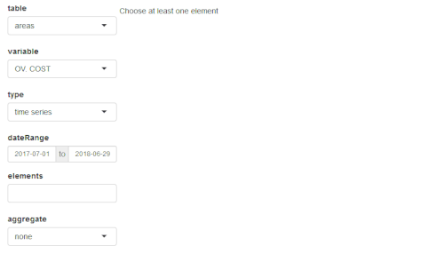

This package works along with RTE's adequacy software ANTARES : https://antares.rte-france.com/

`antaresViz` is a package which proposes relevant graphs and maps to vizualize the results of an ANTARES study, with numerous settings and possible customizations.


## Where everything starts


```{r loadPackage, message = FALSE, warning=FALSE}
library(antaresViz)
```


The data from an ANTARES study can be imported and easily manipulated using the [antaresRead](https://github.com/rte-antares-rpackage/antaresRead) package.

The examples presented below have been build on a fictionnal study whose output have been loaded with antaresRead. They contains different types of elements :

  * outputs with an annual and an hourly time step,
  * synthetic outputs (averaged on several Monte-Carlo years) and detailled outputs (given year by year),
  * outputs for areas, links, clusters and districts.
  
  
```{r loadData, message = FALSE}
load("data_for_antaresViz_vignette_extralight.Rdata")
```  

The aim of this vignette is to give a quick overview of the possibilities offered by the package antaresViz. The data with which the following graphs have been plotted are fictionnal.

## The simple power of the `plot` function

The `plot()` function, used with an antaresDataList object (i.e. an object returned by the `antaresRead::readAntares()` function) offers different possible vizualisations.

Moreover, this function is __really easy to use__. It opens a shiny interface which let the user decide :

* Which type of __element__ he wants to study : areas, links or disctricts.
* Which __variable__ he wants to analyze.
* With which type of __graph__ : barplot, time series, probability density function, heatmap, etc.
* For which area(s), link(s), or district(s).
* And during which __time period__.


```r
plot(data_hourly_synthesis)
```




Note that all the interface manipulation can also be set directly in the arguments of the `plot` function. Some examples of the multiple graphs that can be returned by this function are given below.

###### Barplot of Loss of Load Duration (LOLD) for several districts of the study

```{r barplot, eval = FALSE}
plot(data_annual_synthesis, table = "districts" ,variable = "LOLD", type = "barplot", elements = c("00_a", "00_b", "00_c", "00_d", "00_e", "00_f", "00_g", "00_h", "00_i"), interactive = FALSE, width = "100%", height = 400)
```


###### Time series of the load in an area with average value and 95% confidence interval.

```{r ts, eval=FALSE}
plot(data_hourly_allmc, table = "areas" ,variable = "LOAD", type = "ts", elements = "23_b", confInt = 0.95, dateRange = c("2018-01-08", "2018-01-14"), width = "100%", height = 400, interactive = FALSE)
```


###### Probability density function of the wind power generation in two areas
```{r density, eval=FALSE}
plot(data_hourly_synthesis, table = "areas" ,variable = "WIND", type = "density", elements = c("01_a", "02_a"), interactive = FALSE, width = "100%", height = 400)
```


###### Heatmap of the congestion probability of one interconnection

```{r heatmap, eval=FALSE}
plot(data_hourly_synthesis_1year, table = "links", variable = "CONG. PROB +", type = "heatmap", elements = "25_c - 26_d", interactive = FALSE, width = "100%", height = 400, main = "Congestion probability")
```


Note that the `plot()` function also contains a `compare` argument which allows comparisons between :

* different variables 
* different areas/links/district
* different studies


## When the production meets the demand

The `prodStack` function builds a graph which contains the time series of demand in one area (or the sum of the demand of a set of areas) along with the generation of this area (or set of areas), divided between the different fuel types (e.g. nuclear, gas, wind, etc).


```r
prodStack(data_hourly_synthesis)
```

Once again, this function is easy to use and opens a shiny interface which let the user manipulate the selected areas and time range. Some settings can also be passed to the function through its (optionnal) arguments.

```{r prodStack, eval = FALSE}
prodStack(data_hourly_synthesis, stack = "eco2mix", areas = "37_h", dateRange = c("2018-01-08", "2018-01-21"), main = "Production stack", unit = "GWh",  interactive = FALSE, width = "100%", height = 500)
```

The graphical template used by default is the one of the RTE's application [eco2mix](http://www.rte-france.com/fr/eco2mix/eco2mix-mix-energetique). This template can though be redefined completely by the user with the function `setProdStackAlias()`.

The `exchangesStack()` function proposes similar graphs with a superposition of all the imports and exports of an area.

```{r exchangeStack, eval = FALSE}
exchangesStack(data_hourly_synthesis, area = "37_h", dateRange = c("2018-01-08", "2018-01-21"), main = "Import/Export of area 37_h", unit = "GWh",  interactive = FALSE, width = "100%", height = 500)
```

## Everything looks better on a map

Last but not least, `antaresViz` proposes several function to vizualise the results of a study on a map.

To do so, the first function to use is `mapLayout()`. This function launches an interactive application that let the user place areas of the ANTARES study on a map.


```r
antares_layout <- antaresRead::readLayout(opts = antaresRead::setSimulationPath(study_path))
map_layout <- mapLayout(layout = antares_layout)
```


(Once again : the study presented here is fictionnal !)


The function `plotMap()` then  generates an interactive map that let the user visually explore the results of an Antares simulation. By default the function starts a Shiny gadget that let the user choose :

  * Which __variable__ to represent
  * With which __type of vizualisation__
      - areas : color, size, popup, label
      - links : color, width of the link, popup
  * For which __time step__ or __date range__


```r
plotMap(data_hourly_synthesis, map_layout)
```

Some examples of results returned by the `plotMap()` function are depicted below.


###### C02 emissions

This first map depicts the annual CO2 emissions of all the areas of the ANTARES study.


```{r plotmap_co2, eval = FALSE}
plotMap(data_annual_filtered, map_layout, showLabels = TRUE, sizeAreaVar = "CO2 EMIS.", interactive = FALSE, labelAreaVar = "CO2 EMIS.", colAreaVar = "CO2 EMIS.", type = "avg", options = plotMapOptions(areaDefaultSize = 30, labelMaxSize = 8, labelMinSize = 14, areaColorScaleOpts = colorScaleOptions(zeroCol = "white", posCol = "red2")), width = "100%", height = 600)
```


###### Average balance and flows in the system

This map illustrates the annual balance (MWh exported if positive - or imported if negative - during an hour) of each area and the annual flows of each link.

```{r plotmap_flows, eval = FALSE}
plotMap(data_annual_synthesis, map_layout, showLabels = TRUE, colAreaVar = "BALANCE", interactive = FALSE, labelAreaVar = "BALANCE", sizeLinkVar = "FLOW LIN.", type = "avg", options = plotMapOptions(areaDefaultSize = 30, labelMaxSize = 10, labelMinSize = 8, areaColorScaleOpts = colorScaleOptions(negCol = "tomato3", zeroCol = "white", posCol = "blue3")), width = "100%", height = 600)
```


###### Energy mixes

The proportion of each energy type in the annual production of each area is illustrated on this next map. The actual generated energies (in MWh) can be known by clicking on the pie charts.

```{r plotmap_mix, eval = FALSE}
data_annual_synthesis$areas <- data_annual_synthesis$areas[, `:=`(THERMAL = NUCLEAR + LIGNITE + COAL + GAS + OIL + `MIX. FUEL` + `MISC. DTG`, HYDRO =`H. ROR` + `H. STOR`)]

plotMap(data_annual_synthesis, map_layout, interactive = FALSE, sizeAreaVars = c("HYDRO", "SOLAR", "WIND", "THERMAL"), popupAreaVars = c("HYDRO", "SOLAR", "WIND", "THERMAL"),areaChartType = "pie", type = "avg", options = plotMapOptions(areaDefaultSize = 25), width = "100%", height = 600)
```


## Let's get started

The `antaresViz` package is available on the CRAN and can be installed with :
```r
install.packages("antaresViz")
```

